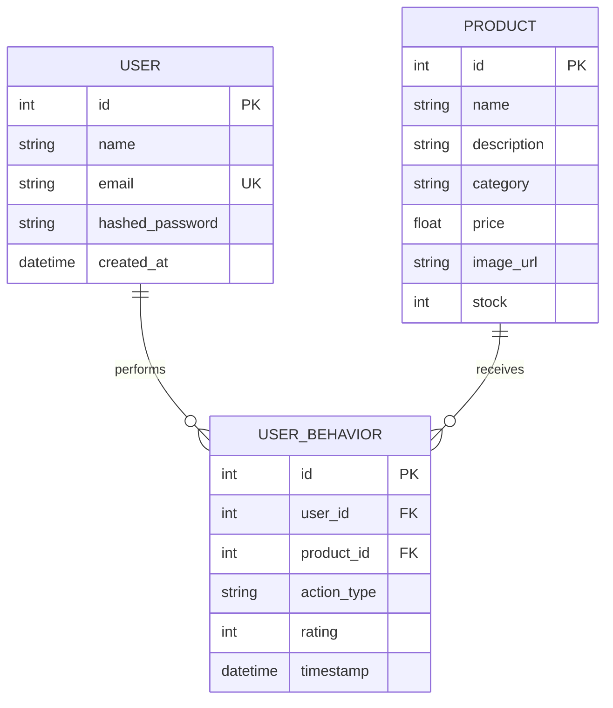

# System Architecture Spec: AuroraShop ML Recommendation Platform

This document describes the structural architecture, database schemas, API contracts, caching mechanisms, and mathematical modeling powering the AuroraShop Recommendation Engine.

---

## 1. High-Level Component Design

The platform consists of four distinct architectural layers, communicating via RESTful interfaces and secure pipelines:

```
┌────────────────────────────────────────────────────────────────────────┐
│                          1. Presentation Layer                         │
│   - React 18 Single Page Application (Vite Build)                      │
│   - Tailwind CSS Visual System (Glassmorphic dark UI)                  │
│   - Telemetry Emitters (Views, Clicks, Add-to-cart, Ratings checkout)  │
└──────────────────────────────────┬─────────────────────────────────────┘
                                   │ HTTPS REST / JWT Headers
                                   ▼
┌────────────────────────────────────────────────────────────────────────┐
│                             2. API Layer                               │
│   - FastAPI (Asynchronous framework with automated schema docs)       │
│   - JWT Bearer Token Security / bcrypt Hashing Gateway                 │
│   - CORS / Proxy Redirections (Vite dev proxy -> Uvicorn -> Nginx)     │
└──────────────────────────────────┬─────────────────────────────────────┘
                                   │ Database Connections / Cache Keys
                                   ▼
┌────────────────────────────────────────────────────────────────────────┐
│                        3. Persistence & Cache                          │
│   - PostgreSQL Database (Primary storage for production stack)         │
│   - SQLite Local Database (High-resilience local development backup)    │
│   - Redis Key-Value Store (1-hour TTL recommendation cache layer)      │
└──────────────────────────────────┬─────────────────────────────────────┘
                                   │ Serialization / Batch Processing
                                   ▼
┌────────────────────────────────────────────────────────────────────────┐
│                          4. Machine Learning Engine                    │
│   - TF-IDF Vectorization & Cosine Similarity Matrices (.pkl format)    │
│   - Custom Singular Value Decomposition (SVD) with SGD Latent Factors   │
│   - Hybrid Engine Resolver (SVD Collaborative + Content Cosine Match)  │
└────────────────────────────────────────────────────────────────────────┘
```

---

## 2. Recommendation Engines & Mathematical Formulations

AuroraShop resolves cold-start and high-density recommendation request vectors using a multi-tiered ML pipeline:

### A. Collaborative Filtering (Custom Latent Factor SVD)
Traditional collaborative models fail when sparse datasets lack explicit user star ratings. AuroraShop overcomes this by compiling implicit behavioral interactions (views, clicks, cart additions, purchases) into a synthesized continuous ratings scale $R_{u, i} \in [1.0, 5.0]$.

The predicted rating $\hat{r}_{u,i}$ for user $u$ on product $i$ is modeled mathematically as:
$$\hat{r}_{u,i} = \mu + b_u + b_i + P_u \cdot Q_i^T$$

Where:
- $\mu$: The global average rating across the training split.
- $b_u$: User bias coefficient (accounts for user-specific optimism/pessimism).
- $b_i$: Item bias coefficient (accounts for product-specific overall quality).
- $P_u$: Latent factor vector of user $u$ ($1 \times k$ dimensions, $k = 30$ latent factors).
- $Q_i$: Latent factor vector of item $i$ ($1 \times k$ dimensions, $k = 30$ latent factors).

#### SGD Optimization Objective
We minimize the squared error over observed interactions with $L_2$ regularization to prevent model overfitting:
$$\min_{P, Q, b} \sum_{(u,i) \in R} \left(r_{u,i} - \hat{r}_{u,i}\right)^2 + \lambda \left( b_u^2 + b_i^2 + \|P_u\|_2^2 + \|Q_i\|_2^2 \right)$$
Regularization rate $\lambda = 0.02$, Learning rate $\gamma = 0.005$, Epochs $= 20$.

---

### B. Content-Based Filtering (NLP TF-IDF & Cosine Similarity)
To capture text-based similarity between product sheets, metadata features (`name`, `category`, `description`) are unified into a normalized string representation.

#### Term Frequency-Inverse Document Frequency (TF-IDF)
The text is vectorized into a sparse n-gram space ($1 \le \text{n-gram} \le 2$):
$$\text{TF-IDF}(t, d, D) = \text{TF}(t, d) \times \text{IDF}(t, D)$$

$$\text{IDF}(t, D) = \log\left( \frac{1 + |D|}{1 + |\{d \in D : t \in d\}|} \right) + 1$$

Where:
- $\text{TF}(t, d)$: Term frequency of word $t$ in product document $d$.
- $|D|$: Total count of items in catalogue database.

The cosine similarity between product vectors $A$ and $B$ determines item similarity scores:
$$\text{CosineSimilarity}(A, B) = \frac{A \cdot B}{\|A\|_2 \|B\|_2}$$

---

### C. Hybrid Recommendation Scoring Formula
To balance collaborative interest and item-specific semantics, final recommendation scores $H(u, i)$ combine normalized predictions:
$$H(u, i) = w_{\text{CF}} \cdot \bar{r}_{u, i}^{\text{SVD}} + w_{\text{CB}} \cdot \text{CosineSimilarity}(i, \text{Liked}_u)$$

Where:
- $w_{\text{CF}} = 0.60$ ($60\%$ weight allocated to Collaborative Latent SVD).
- $w_{\text{CB}} = 0.40$ ($40\%$ weight allocated to Content-Based Semantic Cosine similarity).
- $\text{Liked}_u$: Unified vectors representing items rated $\ge 4.0$ or purchased/added to cart by user $u$.

---

## 3. Database Schema Models (ER Diagram)

The underlying relational schema maintains referential integrity across transactional entities:



---

## 4. Performance Caching Architecture (Redis Layer)

High-traffic deployments suffer severe performance degradation if complex mathematical computations are executed directly on the live request path. To solve this, a high-performance Redis caching layer is implemented:

```
User Requests Recommendations
             │
             ▼
    Check Redis Cache?
     /            \
  (Yes)          (No)
   /              \
Cache Hit      Cache Miss
  /                \
Return JSON     Fetch User Interactions & Run ML SVD + TF-IDF Math
(TTL 1-Hour)        │
                    ▼
               Update Redis cache with calculated recommendations list (TTL 1-Hour)
                    │
                    ▼
               Return JSON payload to React client
```

- **TTL (Time to Live):** 1 Hour (balances fresh recommendation profiles with high throughput).
- **Graceful Fallback:** If the Redis server experiences offline latency or connection errors, the system seamlessly redirects queries to an memory-safe `InMemoryCache` structure, preventing service outages.

---

## 5. Security & Authentication Layer
- **Encryption Hashing:** Standard password inputs are processed directly via the `bcrypt` library, applying dynamic salts before storing them.
- **Session Tokens:** Auth endpoints exchange validated credentials for standard, cryptographically signed JSON Web Tokens (JWT) using the `HS256` signature algorithm.
- **Client Storage:** Tokens are securely stored in the browser's `localStorage` and attached to outgoing requests automatically via Axios request interceptors.
